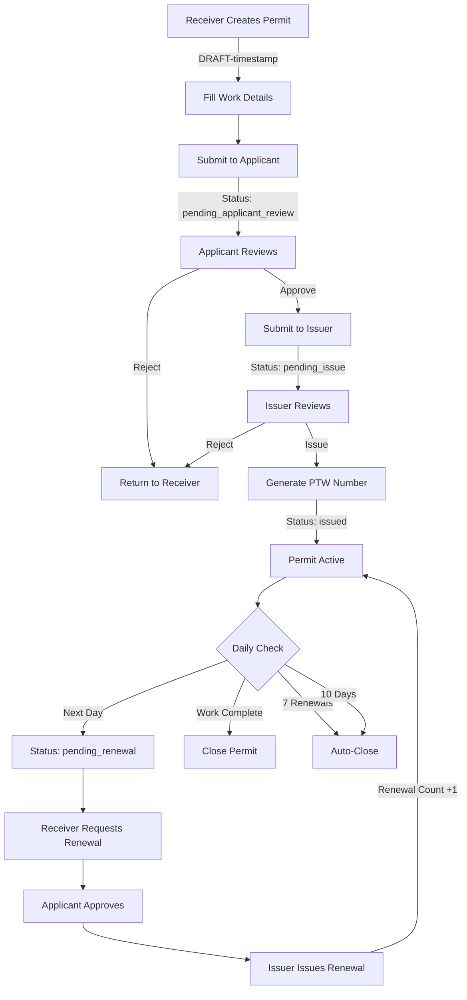

# Electronic Permit-to-Work System

A comprehensive digital platform that transforms traditional paper-based permit-to-work processes into a streamlined electronic workflow with role-based approvals, real-time tracking, and enhanced safety compliance.


## 🌟 Features

### Core Functionality

- **Interactive Application Form** - Dynamic fields adapting to 7 work types (Cold Work, Hot Work, Confined Space, Working at Height, Electrical Work, Excavation, Lifting Operations)
- **Role-Based Workflow** - Three-stage approval process (Receiver → Applicant → Issuer)
- **Dashboard Interface** - Color-coded status indicators (draft, pending, issued, active, expired, closed) for at-a-glance permit management
- **Secure Digital Signatures** - Role-based access control ensuring proper authorization at different approval levels
- **Automated Permit Numbering** - Standard format PTW-YYYY-WW-CCC (Year-Week-Counter)
- **Permit Renewal System** - Up to 7 daily renewals with complete tracking history
- **PDF Export** - Generate permits with embedded QR codes for quick on-site verification
- **Permit Register** - Comprehensive tracking of all permits with search and filter capabilities
- **User Management** - Admin panel for managing users, roles, and departments
- **QR Code Verification** - Instant permit validation via mobile scanning

### Work Types Supported

1. **Cold Work** - General maintenance and non-hazardous activities
2. **Hot Work** - Welding, cutting, grinding, and other spark-producing operations
3. **Confined Space** - Entry into tanks, vessels, or enclosed spaces
4. **Working at Height** - Activities above ground level requiring fall protection
5. **Electrical Work** - Electrical installations and maintenance
6. **Excavation** - Digging, trenching, and ground disturbance activities
7. **Lifting Operations** - Crane operations and heavy lifting activities

## 🚀 Getting Started

### Prerequisites

- Node.js (v18 or higher)
- npm or yarn package manager
- Supabase account (for database and authentication)

### Installation

1. Clone the repository:
```bash
git clone <repository-url>
cd permit-to-work-system
```

2. Install dependencies:
```bash
npm install
```

3. Configure Supabase:
   - Create a new Supabase project at [supabase.com](https://supabase.com)
   - Set up environment variables (see Configuration section)
   - Run database migrations (see Database Setup section)

4. Start the development server:
```bash
npm run dev
```

5. Open your browser and navigate to `http://localhost:5173`

### Build for Production

```bash
npm run build
```

The production-ready files will be generated in the `dist` directory.

## 🗄️ Database Setup

### Running Migrations

The project includes SQL migration files in `supabase/migrations/`:

1. **20240101000000_initial_schema.sql** - Base schema with users, permits, and history tables
2. **20240322000001_create_permits_table.sql** - Enhanced permits table structure
3. **20240322000002_add_missing_tables.sql** - Approval and renewal history tables
4. **20240322000003_add_demo_permits.sql** - Sample data for testing
5. **20240322000004_permit_number_function.sql** - Auto-generate permit numbers

Run migrations in order using Supabase CLI or dashboard SQL editor.

### Database Schema

```sql
-- Main Tables
users                 -- User accounts with role-based access
permits               -- Core permit information
approval_history      -- Tracks all workflow actions
renewal_history       -- Detailed renewal tracking
permit_documents      -- File attachments

-- Key Features
- UUID primary keys
- Automatic timestamp updates
- Foreign key constraints
- Indexed for performance
- Row-level security ready
```

### Permit Number Generation

Permits use a standardized numbering system:
- **Format**: `PTW-YYYY-WW-CCC`
- **PTW**: Constant prefix
- **YYYY**: 4-digit year
- **WW**: ISO week number (01-53)
- **CCC**: Sequential counter (001-999)

Example: `PTW-2024-51-001` (First permit in week 51 of 2024)

## 📁 Project Structure

```
src/
├── components/          # React components
│   ├── Dashboard.tsx    # Main dashboard with statistics
│   ├── LoginPage.tsx    # Authentication page
│   ├── PermitForm.tsx   # Dynamic permit application form
│   ├── PermitDetails.tsx # Permit review, approval, and issuance
│   ├── PermitRegister.tsx # Permit tracking and management
│   ├── StatusDashboard.tsx # Status-based permit views
│   ├── UserManagement.tsx # Admin user management
│   ├── PermitVerification.tsx # QR code verification
│   └── ui/              # Reusable UI components (ShadCN)
├── contexts/            # React context providers
│   ├── AuthContext.tsx  # Authentication state management
│   └── PermitContext.tsx # Permit data management
├── lib/                 # Utility functions
│   ├── pdfGenerator.ts  # PDF generation with QR codes
│   ├── supabaseClient.ts # Supabase configuration
│   └── utils.ts         # Helper functions
├── types/               # TypeScript type definitions
│   ├── permit.ts        # Permit-related types
│   └── supabase.ts      # Database types (auto-generated)
└── stories/             # Component stories for Storybook

database/
└── schema.sql           # Complete database schema

supabase/
└── migrations/          # Database migration files
```

## 🔐 User Roles & Workflow

### Roles

1. **Admin**
   - Full system access
   - User management (add, edit, delete users)
   - View all permits across departments
   - System configuration

2. **Receiver** (Permit Applicant)
   - Create permit applications
   - Fill in work details and hazards
   - Submit to Applicant for review
   - Request permit renewals
   - View own permits

3. **Applicant** (Permit Reviewer)
   - Review permits from Receivers
   - Verify work details and safety measures
   - Approve and forward to Issuer
   - Reject or return for modifications
   - Approve renewal requests

4. **Issuer** (Permit Authorizer)
   - Final permit approval and issuance
   - Generate official permit numbers
   - Digital signature authority
   - Issue permit renewals
   - Close permits after work completion

### Permit Workflow



### Permit Lifecycle

1. **Creation** (Receiver)
   - Temporary number: `DRAFT-{timestamp}`
   - Status: `draft` or `pending_applicant_review`

2. **Review** (Applicant)
   - Verify work details
   - Status: `pending_issue` (if approved)

3. **Issuance** (Issuer)
   - Generate final number: `PTW-2024-51-001`
   - Status: `issued`
   - Valid for 24 hours

4. **Renewal** (Up to 7 times)
   - Daily renewal required
   - Same permit number maintained
   - Renewal history tracked

5. **Closure**
   - Manual close by Issuer
   - Auto-close after 7 renewals
   - Auto-close after 10 days

## 🛠️ Technology Stack

### Frontend
- **Framework**: React 18.2 with TypeScript
- **Build Tool**: Vite 6.2
- **Styling**: Tailwind CSS 3.4
- **UI Components**: ShadCN UI (Radix UI primitives)
- **Routing**: React Router v6
- **Form Management**: React Hook Form with Zod validation
- **State Management**: React Context API
- **Icons**: Lucide React
- **Animations**: Framer Motion

### Backend & Database
- **Database**: Supabase (PostgreSQL)
- **Authentication**: Supabase Auth
- **Real-time**: Supabase Realtime
- **Storage**: Supabase Storage (for documents)

### PDF & QR Code
- **PDF Generation**: jsPDF
- **QR Codes**: qrcode library
- **Verification**: QR codes link to live permit details

## ��� UI Components

Built with [ShadCN UI](https://ui.shadcn.com/) for consistent, accessible, and customizable components:

- **Forms**: Input, Select, Checkbox, Radio, Textarea, Date Picker
- **Data Display**: Table, Card, Badge, Avatar, Accordion
- **Feedback**: Alert, Toast, Dialog, Alert Dialog, Progress
- **Navigation**: Tabs, Dropdown, Command Menu, Navigation Menu
- **Layout**: Separator, Collapsible, Resizable Panels, Scroll Area

## 📱 QR Code Verification

Each permit PDF includes a QR code that:
- Links to the live permit verification page
- Shows real-time permit status
- Displays complete permit information
- Tracks approval and renewal history
- Verifies permit authenticity instantly

Scan format: `https://your-app-url/verify?permitNumber=PTW-2024-51-001`

## 🔧 Configuration

### Environment Variables

Set these in your Supabase project settings or `.env` file:

```bash
VITE_SUPABASE_URL=your-supabase-project-url
VITE_SUPABASE_ANON_KEY=your-supabase-anon-key
SUPABASE_PROJECT_ID=your-project-id
SUPABASE_URL=your-supabase-url
SUPABASE_ANON_KEY=your-anon-key
SUPABASE_SERVICE_KEY=your-service-role-key
```

### Generate TypeScript Types

Update database types after schema changes:

```bash
npm run types:supabase
```

This generates `src/types/supabase.ts` from your Supabase schema.

### Customization

- **Permit Types**: Modify `src/types/permit.ts` to add/remove work types
- **Departments**: Update department enum in schema and types
- **Styling**: Customize `tailwind.config.js` for theme changes
- **PDF Layout**: Edit `src/lib/pdfGenerator.ts` for PDF formatting
- **Renewal Limit**: Change max renewals in database functions

## 📊 Features in Detail

### Dashboard
- Real-time permit statistics by status
- Quick access to pending approvals
- Status-based filtering (draft, pending, issued, active, expired, closed)
- Recent activity feed with approval history
- Department-wise permit distribution

### Permit Application
- Dynamic form fields based on work type
- Hazard identification checklist
- Safety precautions text area
- Required PPE multi-select
- Work schedule with date/time pickers
- Document upload support (future)
- Digital signature capture

### Permit Register
- Comprehensive permit listing with all details
- Advanced search by permit number, title, location
- Multi-filter by status, type, department, date range
- Sort by date, status, permit number
- Export to PDF
- Bulk actions (future)

### User Management (Admin Only)
- Create new users with role assignment
- Edit existing user details and roles
- Delete users (except self)
- Search and filter users
- Department assignment
- Password management

### Approval History
- Complete audit trail of all actions
- Digital signatures recorded
- Timestamps for all approvals
- Comments and rejection reasons
- Renewal tracking with counter

## 🔒 Security Features

- Role-based access control (RBAC)
- Secure authentication via Supabase
- Password hashing (bcrypt in production)
- Row-level security policies (RLS)
- Digital signature verification
- Audit trail for all actions
- QR code validation

## 🚦 Git & GitHub Compatibility

### Git Configuration

The project is fully configured for Git version control:

```bash
# Initialize repository
git init

# Add remote
git remote add origin <your-repo-url>

# Commit and push
git add .
git commit -m "Initial commit"
git push -u origin main
```

### .gitignore

Properly configured to exclude:
- `node_modules/` - Dependencies
- `dist/` - Build output
- `*.local` - Local environment files
- `tempobook/` - Tempo-specific files
- `.github/` - GitHub workflows (not supported in Tempo)
- Editor files (.vscode, .idea)

### GitHub Features

- ✅ Standard Git workflow
- ✅ Branch management
- ✅ Pull requests
- ✅ Issue tracking
- ✅ GitHub Pages deployment
- ✅ Vercel/Netlify integration
- ❌ GitHub Actions (not supported in Tempo)

## 📦 Deployment

### Vercel (Recommended)

```bash
# Install Vercel CLI
npm i -g vercel

# Deploy
vercel
```

### Netlify

```bash
# Install Netlify CLI
npm i -g netlify-cli

# Deploy
netlify deploy --prod
```

### Environment Variables

Set these in your deployment platform:
- `VITE_SUPABASE_URL`
- `VITE_SUPABASE_ANON_KEY`

## 🤝 Contributing

Contributions are welcome! Please follow these steps:

1. Fork the repository
2. Create a feature branch (`git checkout -b feature/AmazingFeature`)
3. Commit your changes (`git commit -m 'Add some AmazingFeature'`)
4. Push to the branch (`git push origin feature/AmazingFeature`)
5. Open a Pull Request

### Development Guidelines

- Follow TypeScript best practices
- Use existing UI components from ShadCN
- Maintain consistent code formatting
- Add comments for complex logic
- Update types when changing database schema
- Test all user roles and workflows

## 📄 License

This project is licensed under the MIT License - see the LICENSE file for details.

## 🙏 Acknowledgments

- Built with [Tempo](https://tempo.build) - Visual development platform
- UI components from [ShadCN UI](https://ui.shadcn.com/)
- Icons from [Lucide](https://lucide.dev/)
- Database by [Supabase](https://supabase.com/)
- PDF generation by [jsPDF](https://github.com/parallax/jsPDF)

## 📞 Support

For support, please:
- Open an issue in the GitHub repository
- Check existing documentation
- Contact the development team

## 🗺️ Roadmap

- [ ] Email notifications for status changes
- [ ] SMS alerts for expiring permits
- [ ] Mobile app (React Native)
- [ ] Document upload and management
- [ ] Advanced reporting and analytics
- [ ] Integration with safety management systems
- [ ] Multi-language support
- [ ] Offline mode with sync

---

**Built with ❤️ for workplace safety and compliance**

**Version**: 1.0.0  
**Last Updated**: 2024  
**Status**: Production Ready